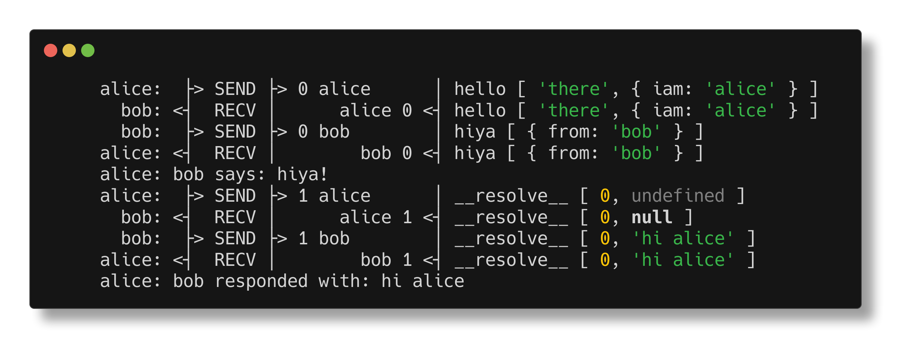

<h1 align="center">👫<br>alice-bob</h1>

<p align="center">
transport agnostic strongly typed duplex rpc interfaces
</p>

<p align="center"></p>

<p align="center">
   <a href="#install">        🔧 <strong>Install</strong></a>
 · <a href="#example">        🧩 <strong>Example</strong></a>
 · <a href="#api">            📜 <strong>API docs</strong></a>
 · <a href="https://github.com/stagas/alicebob/releases"> 🔥 <strong>Releases</strong></a>
 · <a href="#contribute">     💪🏼 <strong>Contribute</strong></a>
 · <a href="https://github.com/stagas/alicebob/issues">   🖐️ <strong>Help</strong></a>
</p>

***

## Install

```sh
$ npm i alice-bob
```

## Example

```ts
// alice

import { fork } from 'child_process'
import { join } from 'path'

import { Alice } from 'alice-bob'

// we import Bob's interface and call it Remote
// bob will show as Agent<Remote> in intellisense
import type { Interface as Remote } from './bob'

export interface Interface {
  hiya: (message: { from: string }) => Promise<void>
}

// for intellisense reasons we alias our interface to `Local`
// so that alice shows as Agent<Local> and bob as Agent<Remote>
type Local = Interface

// start bob
const child = fork(join(__dirname, 'bob'))

// create an Alice instance with given `send` function as the
// constructor parameter. Note that Alice, Bob both inherit from
// the AliceBob class, the only thing they change is they have
// the names "alice" and "bob" preconfigured in their agents
const [alice, bob] = new Alice<Local, Remote>(
  data => void child.send(data)
).agents()

// all messages from bob passed to alice.receive
child.on('message', alice.receive)

// we can set debug=true|false at any time
alice.debug = true

// methods can be added also lazily at any time at any scope..
alice.hiya = async ({ from }) => {
  alice.log(from, 'says: hiya!')
  // => alice: bob says: hiya!
  // `agent.log()` prepends the agent's name to the output
}

const sayHello = async () => {
  const result = await bob.hello('there', { iam: alice.name })
  alice.log('bob responded with:', result)
  // => alice: bob responded with: hi alice

  process.exit(0)
}

sayHello()
```

```ts
// bob

import { Bob } from 'alice-bob'
import type { Interface as Remote } from './alice'

export interface Interface {
  hello: (message: string, data: { iam: string }) => Promise<string>
}

type Local = Interface

const [bob, alice] = new Bob<Local, Remote>().agents({ debug: true })

// we connect our transport in just these two lines
process.on('message', bob.receive)

// send method can be provided at any time
bob.send = data => void process.send!(data)

bob.hello = async (message, { iam }) => {
  bob.log(iam + ' says: hello ' + message)

  // we can call alice methods as well
  await alice.hiya({ from: 'bob' })

  // if we throw here the remote's `await`
  // will throw as well with this message
  // throw new Error('failed :(')

  return 'hi ' + iam
}
```

## API

<!-- Generated by documentation.js. Update this documentation by updating the source code. -->

#### Table of Contents

*   [Payload](#payload)
    *   [id](#id)
    *   [method](#method)
    *   [args](#args)
*   [Agent](#agent)
    *   [debug](#debug)
    *   [name](#name)
    *   [send](#send)
    *   [deferredSend](#deferredsend)
    *   [log](#log)
*   [AliceBob](#alicebob)
    *   [Parameters](#parameters)
    *   [local](#local)
    *   [remote](#remote)
    *   [agents](#agents)
        *   [Parameters](#parameters-1)
*   [Alice](#alice)
    *   [Parameters](#parameters-2)
*   [Bob](#bob)
    *   [Parameters](#parameters-3)

### Payload

[src/index.ts:6-19](https://github.com/stagas/alice-bob/blob/b63afb0d1105e8fd012dfb698294cd0868c5c8bc/src/index.ts#L6-L19 "Source code on GitHub")

Payload.

#### id

[src/index.ts:10-10](https://github.com/stagas/alice-bob/blob/b63afb0d1105e8fd012dfb698294cd0868c5c8bc/src/index.ts#L10-L10 "Source code on GitHub")

Payload id.

Type: [number](https://developer.mozilla.org/docs/Web/JavaScript/Reference/Global_Objects/Number)

#### method

[src/index.ts:14-14](https://github.com/stagas/alice-bob/blob/b63afb0d1105e8fd012dfb698294cd0868c5c8bc/src/index.ts#L14-L14 "Source code on GitHub")

Method to call.

Type: ([string](https://developer.mozilla.org/docs/Web/JavaScript/Reference/Global_Objects/String) | [symbol](https://developer.mozilla.org/docs/Web/JavaScript/Reference/Global_Objects/Symbol))

#### args

[src/index.ts:18-18](https://github.com/stagas/alice-bob/blob/b63afb0d1105e8fd012dfb698294cd0868c5c8bc/src/index.ts#L18-L18 "Source code on GitHub")

The arguments passed to the method.

Type: [Array](https://developer.mozilla.org/docs/Web/JavaScript/Reference/Global_Objects/Array)\<any>

### Agent

[src/index.ts:26-68](https://github.com/stagas/alice-bob/blob/b63afb0d1105e8fd012dfb698294cd0868c5c8bc/src/index.ts#L23-L25 "Source code on GitHub")

Agent.

Type: any

#### debug

[src/index.ts:30-30](https://github.com/stagas/alice-bob/blob/b63afb0d1105e8fd012dfb698294cd0868c5c8bc/src/index.ts#L30-L30 "Source code on GitHub")

Whether or not to log debugging information.

Type: [boolean](https://developer.mozilla.org/docs/Web/JavaScript/Reference/Global_Objects/Boolean)

#### name

[src/index.ts:36-36](https://github.com/stagas/alice-bob/blob/b63afb0d1105e8fd012dfb698294cd0868c5c8bc/src/index.ts#L36-L36 "Source code on GitHub")

The name of the agent. Defaults to either 'alice' or 'bob' depending
on the constructor used, Alice or Bob.

Type: [string](https://developer.mozilla.org/docs/Web/JavaScript/Reference/Global_Objects/String)

#### send

[src/index.ts:41-41](https://github.com/stagas/alice-bob/blob/b63afb0d1105e8fd012dfb698294cd0868c5c8bc/src/index.ts#L41-L41 "Source code on GitHub")

The send method overriden by the user to any transport.

Type: PayloadMethod

#### deferredSend

[src/index.ts:47-47](https://github.com/stagas/alice-bob/blob/b63afb0d1105e8fd012dfb698294cd0868c5c8bc/src/index.ts#L47-L47 "Source code on GitHub")

Returns the send method. Used in contexts where it might
change between sessions, like browser refresh/hot/livereload.

Type: function (): PayloadMethod

#### log

[src/index.ts:57-57](https://github.com/stagas/alice-bob/blob/b63afb0d1105e8fd012dfb698294cd0868c5c8bc/src/index.ts#L57-L57 "Source code on GitHub")

Overridable logging function. Defaults to `console.log()` and prepends `agent.name`.

Type: function (...args: [Array](https://developer.mozilla.org/docs/Web/JavaScript/Reference/Global_Objects/Array)\<any>): void

### AliceBob

[src/index.ts:82-269](https://github.com/stagas/alice-bob/blob/b63afb0d1105e8fd012dfb698294cd0868c5c8bc/src/index.ts#L82-L269 "Source code on GitHub")

AliceBob class.

#### Parameters

*   `send` **PayloadMethod?** The `send` payload method provided by the user. Will be called with a payload to be sent.

#### local

[src/index.ts:95-95](https://github.com/stagas/alice-bob/blob/b63afb0d1105e8fd012dfb698294cd0868c5c8bc/src/index.ts#L95-L95 "Source code on GitHub")

The local Agent.

Type: [Agent](#agent)\<A>

#### remote

[src/index.ts:99-99](https://github.com/stagas/alice-bob/blob/b63afb0d1105e8fd012dfb698294cd0868c5c8bc/src/index.ts#L99-L99 "Source code on GitHub")

The remote Agent.

Type: [Agent](#agent)\<B>

#### agents

[src/index.ts:265-268](https://github.com/stagas/alice-bob/blob/b63afb0d1105e8fd012dfb698294cd0868c5c8bc/src/index.ts#L265-L268 "Source code on GitHub")

Returns the agents tuple `[alice, bob]`.

Example:

```ts
const [alice, bob] = new Alice<Local, Remote>().agents()
```

##### Parameters

*   `options` **AgentsOptions**  (optional, default `{debug:false}`)

    *   `options.debug`  Whether to enable debugging. (optional, default `false`)

### Alice

[src/index.ts:277-287](https://github.com/stagas/alice-bob/blob/b63afb0d1105e8fd012dfb698294cd0868c5c8bc/src/index.ts#L277-L287 "Source code on GitHub")

**Extends AliceBob**

Alice class.

#### Parameters

*   `send` **PayloadMethod?** The `send` payload method provided by the user. Will be called with a payload to be sent.

### Bob

[src/index.ts:295-305](https://github.com/stagas/alice-bob/blob/b63afb0d1105e8fd012dfb698294cd0868c5c8bc/src/index.ts#L295-L305 "Source code on GitHub")

**Extends AliceBob**

Bob class.

#### Parameters

*   `send` **PayloadMethod?** The `send` payload method provided by the user. Will be called with a payload to be sent.

## Contribute

[Fork](https://github.com/stagas/alicebob/fork) or
[edit](https://github.dev/stagas/alicebob) and submit a PR.

All contributions are welcome!

## License

MIT © 2021
[stagas](https://github.com/stagas)
